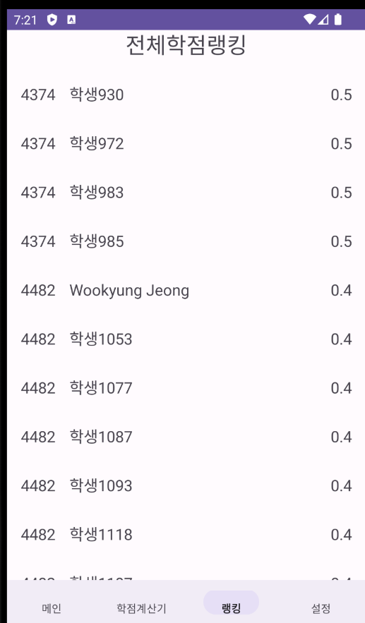

## Project Introduction
"Bill Gates" is an application developed for students of the Department of Computer and Artificial Intelligence at Chonbuk National University. This app efficiently supports the management of grades and class schedules, helping users easily create personalized course roadmaps.

## Responsibilities
- **4-Person Development Team**: Responsible for the login screen, main screen, roadmap screen, grade calculator, and ranking feature.

## Application Specifications
- **Platform**: Android
- **Development Tools**: Android Studio, Kotlin

## Key Features and Characteristics
- **Roadmap Management**: Visualizes multi-step course roadmaps with clear relationships between stages.
- **User Convenience**: Intuitive UI allows easy management of grades and schedules through scroll and touch interactions.

## App Design and UI
- A clean and user-friendly font was used to provide an accessible UI for everyone.
- Gradient effects were applied to buttons to highlight vibrant colors.

## Development Process
- **Week 1**: Scheduled weekly plans using JIRA.
- **Week 2**: Structured basic screens including the menu bar, main screen, and grade calculator.
- **Week 3**: Improved the UI by implementing the database, modifying the grade calculator, and updating the bottom menu bar.
- **Week 4**: Implemented sign-up and logout functionalities.
- **Week 4**: Completed the ranking feature integrated with the database, improved design and conducted testing, added course information by grade level, and improved features such as subject checkboxes.

## Development Period
- **2023.11.17 ~ 2023.12.20**

## Learnings and Achievements
- Gained knowledge on project and data management methodologies.
- Understood the importance of testing through bug fixes and test play processes.

## Future Plans
- Plan to expand the app's usage by adding course roadmaps for other departments.
- Aim to add user customization options to enhance flexibility.

