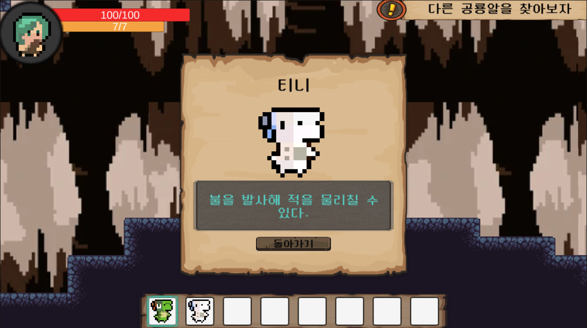
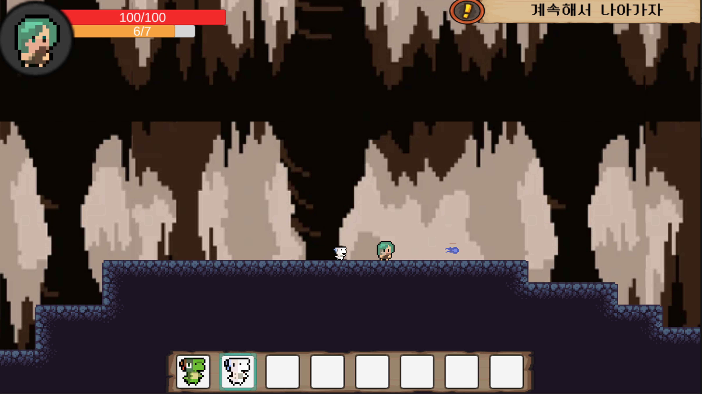
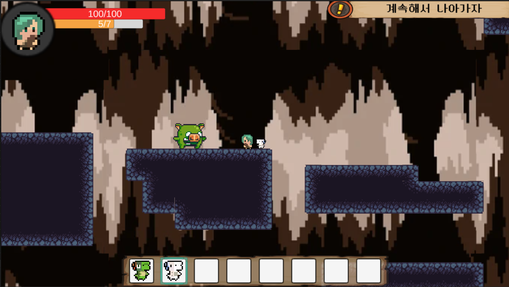

## Project Introduction
"Dino Adventure" is a 2D platformer game where players explore caves alongside baby dinosaurs. The game emphasizes the fun of overcoming various puzzles and obstacles throughout the adventure.

## Responsibilities
- **Solo Development**: Took charge of the overall aspects of the game, including planning, design, programming, and level design.

## Game Specifications
- **Platform**: PC
- **Development Tools**: Unity, C#
- **Graphics Tools**: Photoshop, Aseprite, Unity Asset

## Key Features and Characteristics
- **Unique Cave Map Design**: Explore various cave levels, each with its own puzzles and traps to overcome.
- **Simple Controls**: Designed for easy playability through keyboard movements and jumps.

## Game Design and Graphics
- Dinosaur characters are designed in a cute style.
- The dark background of the cave and sound effects are used to create a gloomy atmosphere.

## Development Process
- **Planning Stage**: Finalized the basic game concept and story, and drafted character designs using Aseprite.
- **Programming Stage**: Implemented the core game systems (player movement, jumping, collision detection) using Unity and added puzzles and obstacles to each level.
- **Testing and Debugging**: Fixed bugs discovered through test plays and adjusted the game's difficulty and balance.

## Development Period
- **2024.05.20 ~ 2024.07.08**

## Learnings and Achievements
- By experiencing the entire game development process with Unity, I improved my programming skills and game design sensibilities.
- Through the completed game, I gained insights into the full game development process, from planning to resource management.

## Future Plans
- Plan to add additional game modes and various stages to provide a richer experience for players.
- Aim to introduce diverse dinosaur character designs and additional skills.

