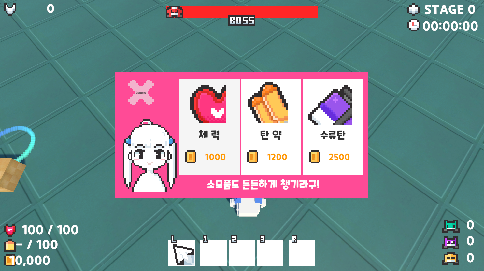
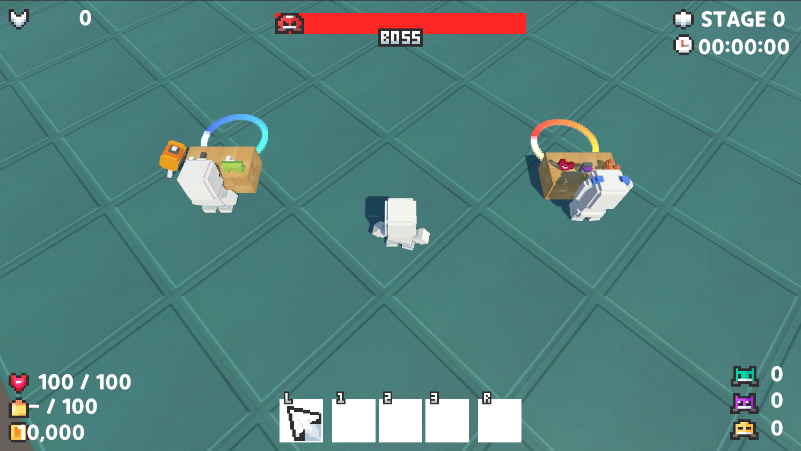
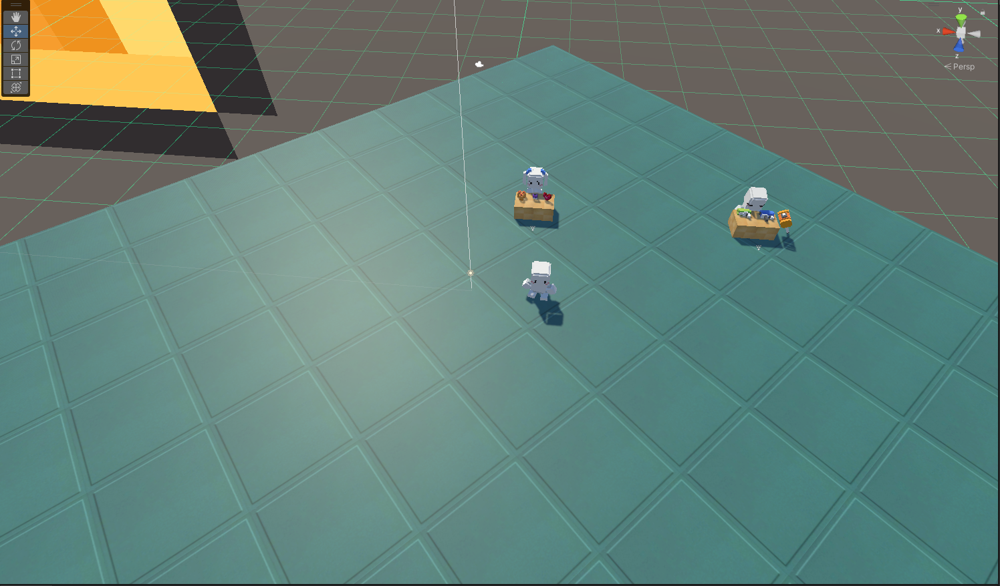

## Practice Focus
"NPC Interaction" focuses on practicing item management and interactions with various objects. It involves implementing the buying and selling of items through conversations with NPCs, learning how to design and create a natural item management system and dialogue interface.

## Tools Used
- **Development Tools**: Unity, C#
- **Graphics Tools**: Photoshop, Aseprite, Unity Asset

## Key Features and Characteristics
- **Interaction**: Implemented interactions with various objects using Unity's Collider and Tag components.
- **Item Generation**: Configured item creation by utilizing Prefabs and Unity's Instantiate function to spawn multiple instances of a single object.

## Practice Period
- **2021.05.20 ~ 2021.06.30**

## Learnings and Achievements
- Learned how to use Colliders and Tags in Unity for interaction and how to implement interactions using the OnCollision function.
- Acquired the skills to generate Prefabs using Instantiate and set the position and rotation of spawned objects.

## Ideas Gained
- Understood how the interaction system with town NPCs in RPG games can be implemented in this way.
- Gained a broader understanding of item management and the mechanics of increasing item count through buying and selling items with NPCs.

[Reference Site](https://www.youtube.com/@goldmetal)

