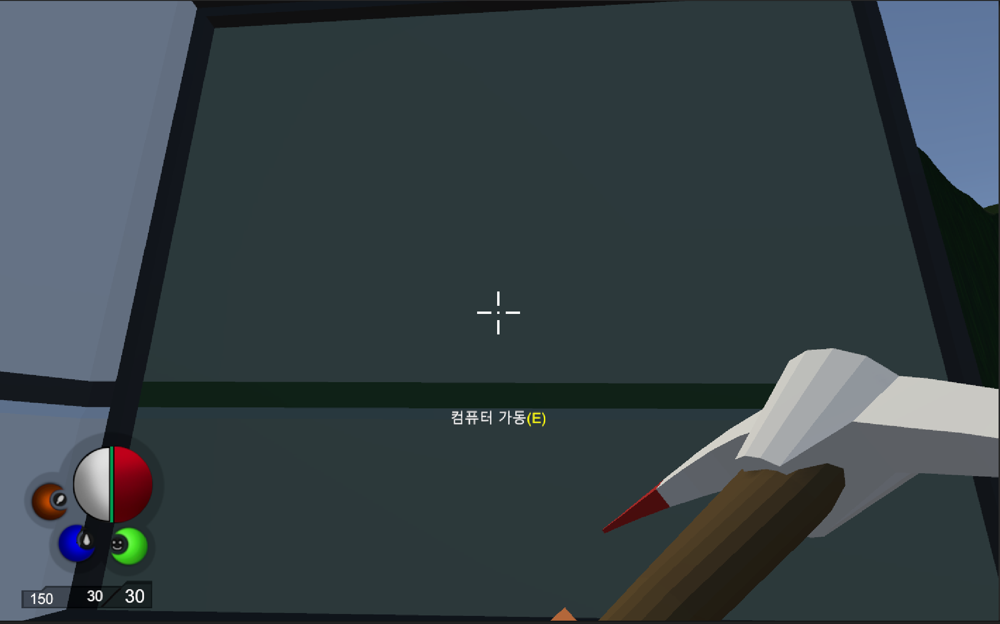

## Practice Focus
In "3D Survival," the focus was on collecting survival items and crafting tools. Through this practice, I experienced the core mechanics of a survival game in a 3D environment.

## Tools Used
- **Development Tools**: Unity, C#
- **Graphics Tools**: Photoshop, Unity Asset

## Key Features and Characteristics
- **Tool Placement**: Used Unity's Layer and RayCast functionalities to place tools and implement interactions with the environment.
- **Movement Animation**: Utilized Unity's Animator and Animation features to express player movements and actions naturally.

## Practice Period
- **2024.08.20 ~ 2024.09.20**

## Learnings and Achievements
- Learned how to use RayCast in Unity to identify Layers and how to place items in specific layer zones.
- Gained an understanding of the roles and differences between Animator and Animation in Unity, as well as methods for creating both automatic and manual animations.

## Ideas Gained
- Learned how to implement the process of collecting resources and building structures in a survival game.
- Understood that smooth animations with detailed movements are achieved through numerous frames.

[Reference Site](https://www.udemy.com/ko/)

