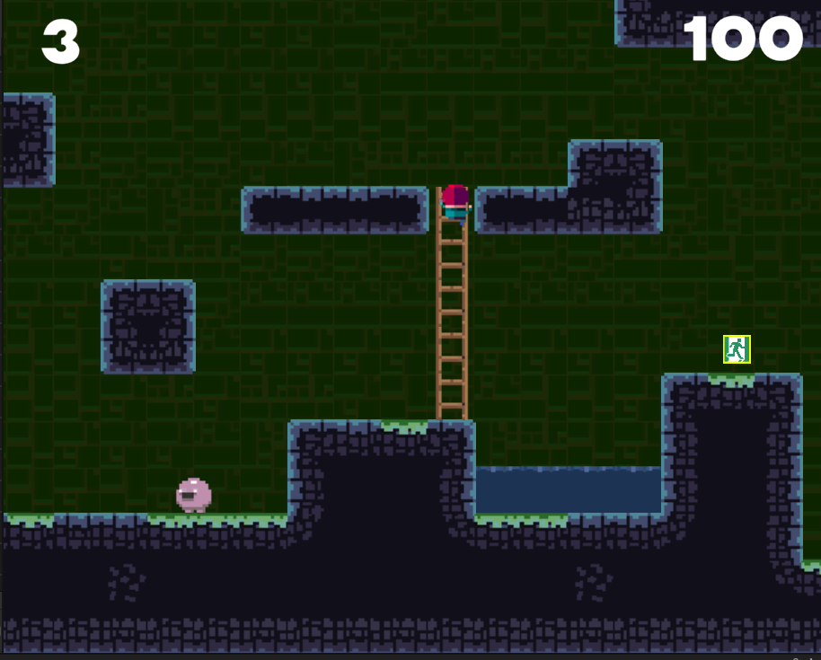
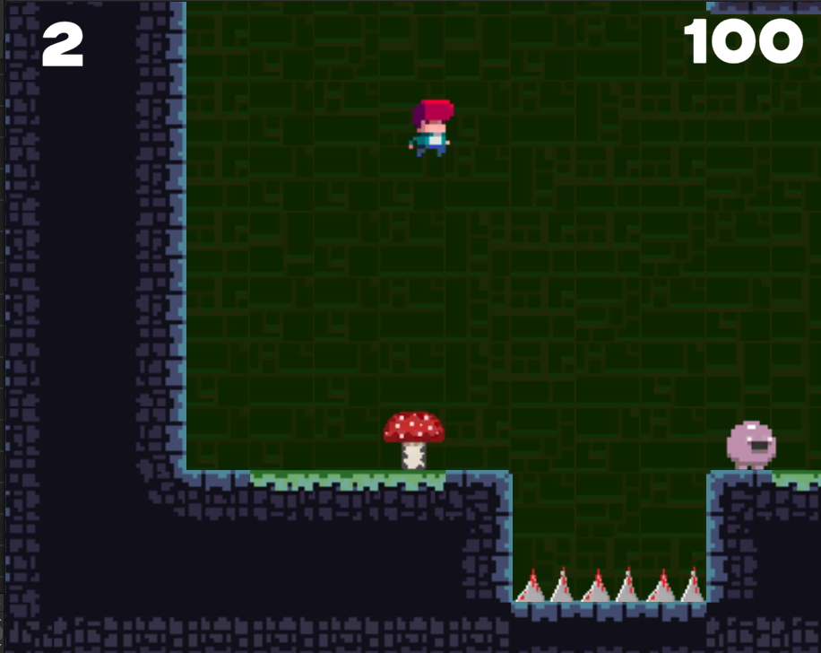
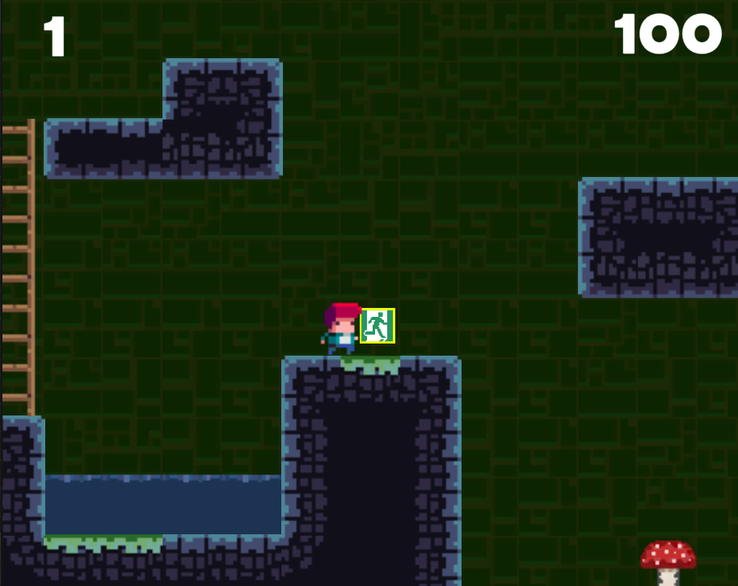

## Practice Focus
In "Tile Bania," the focus was on implementing player movement to escape maze terrains and developing an AI that chases the player. Additionally, transitioning to subsequent mazes helped practice various game mechanisms.

## Tools Used
- **Development Tools**: Unity, C#
- **Graphics Tools**: Photoshop, Unity Asset

## Key Features and Characteristics
- **Scene Transition**: Learned how to navigate between scenes using Unity's SceneManager for scene transitions.
- **AI Implementation**: Used Unity's Colliders to detect contact with the player and implemented an AI that pursues the player.

## Practice Period
- **2024.08.20 ~ 2024.09.20**

## Learnings and Achievements
- Mastered scene transitions using the SceneLoad function of SceneManager.
- Implemented enemy movements to chase the player using simple logic, and designed the AI to stop pursuit under certain conditions, such as detecting cliffs or other terrain features.

## Ideas Gained
- Gained the idea of implementing a system that allows movement between towns and dungeons using SceneManager.
- Learned that simple enemy movements can be effectively created with straightforward logic rather than complex AI functions.

[Reference Site](https://www.udemy.com/ko/)

