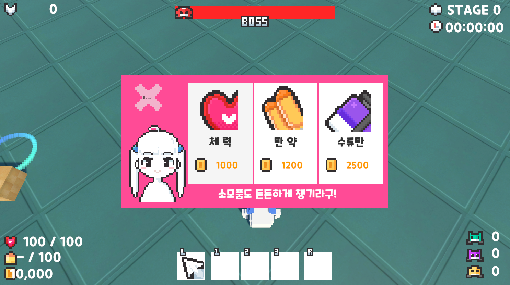
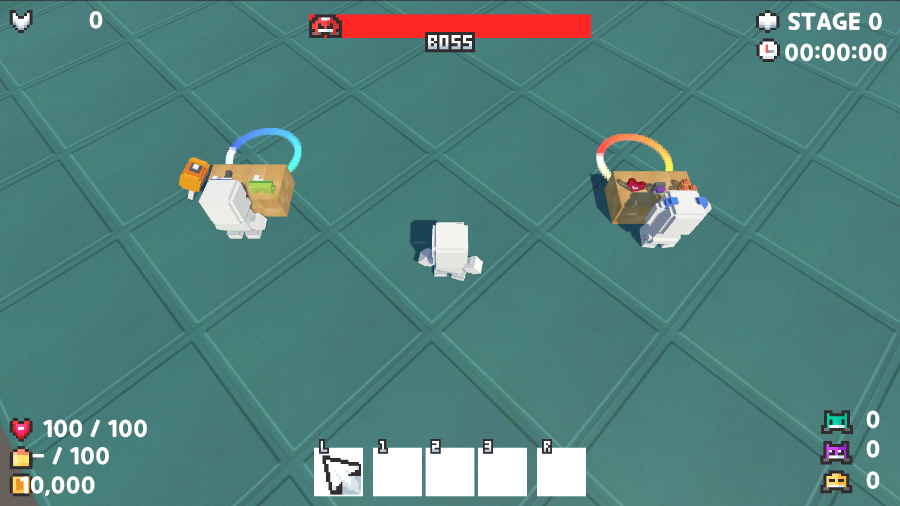
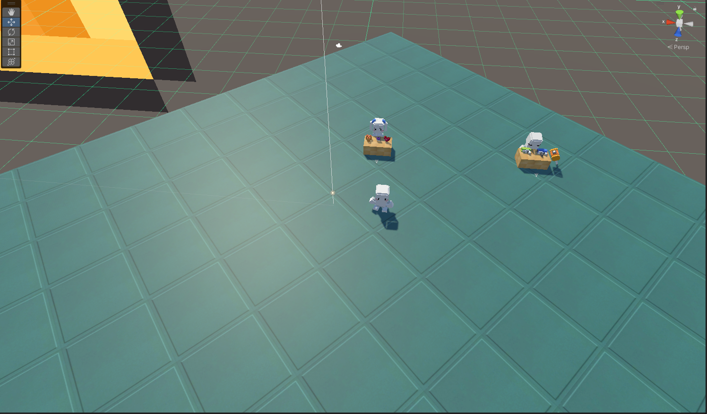

## 연습 중점
"NPC Interaction"는 아이템 관리와 다양한 오브젝트와의 상호작용을 연습하는 데 중점을 두었습니다. NPC와의 대화를 통해 아이템을 사고파는 기능을 구현하며, 자연스러운 아이템 관리 시스템과 대화 인터페이스를 설계하고 제작하는 방법을 익혔습니다.

## 사용 도구
- **개발 툴**: Unity, C#
- **그래픽 툴**: Photoshop, Aseprite, Unity Asset

## 주요 기능 및 특징
- **상호작용**: Unity의 콜라이더(Collider)와 태그(Tag)를 이용하여 다양한 오브젝트와 상호작용을 구현하였습니다.
- **아이템 생성**: 프리팹(Prefab)과 Unity의 Instantiate 함수를 활용하여 하나의 오브젝트를 여러 개로 생성할 수 있도록 구성하였습니다.

## 연습 기간
- **2021.05.20 ~ 2021.06.30**

## 배운 점 및 성과
- Unity에서 콜라이더(Collider)와 태그(Tag)의 상호관계 및 OnCollision 함수를 활용한 상호작용 구현 방법을 배웠습니다.
- Instantiate를 통해 프리팹(Prefab)을 생성하고, 생성된 오브젝트의 위치 및 회전을 설정하는 방법을 습득했습니다.

## 얻은 아이디어
- RPG 게임에서 마을의 NPC와 상호작용하는 시스템이 이러한 방식으로 구현된다는 점을 이해하게 되었습니다.
- NPC와 아이템을 사고파는 과정을 통해 아이템 수가 늘어나는 방식과 아이템 관리에 대한 이해를 넓혔습니다.

[참고사이트](https://www.youtube.com/@goldmetal)

---
