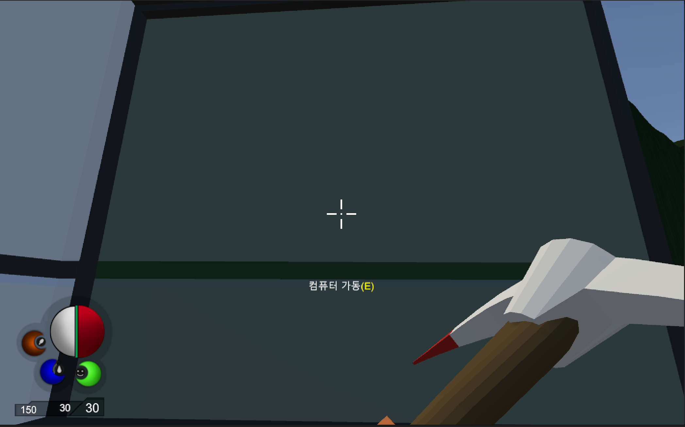
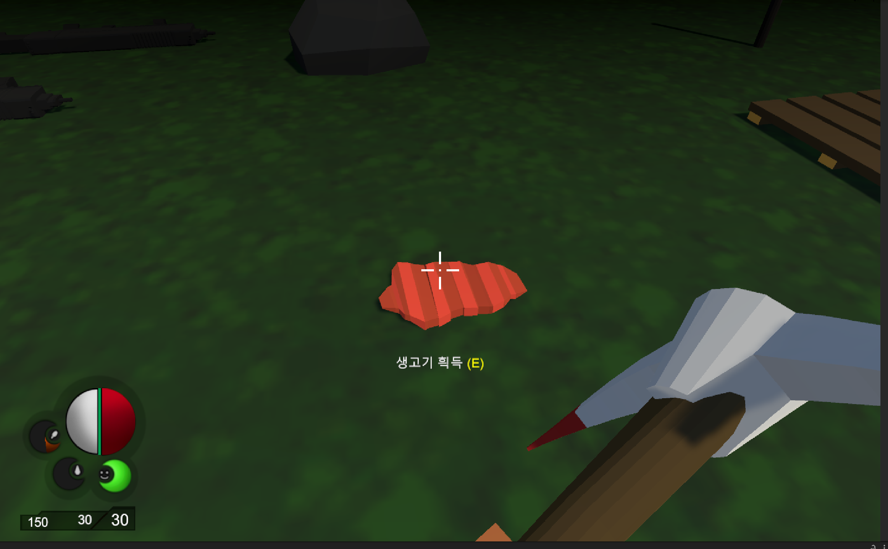

## 연습 중점
"3D Survival"에서는 생존에 필요한 아이템을 수집하고 도구를 제작하는 과정을 연습했습니다. 이러한 연습을 통해 3D 환경에서의 생존 게임의 핵심 메커니즘을 경험해보았습니다.

## 사용 도구
- **개발 툴**: Unity, C#
- **그래픽 툴**: Photoshop, Unity Asset

## 주요 기능 및 특징
- **도구배치**: Unity의 레이어(Layer)와 레이캐스트(RayCast)를 활용하여 도구를 배치하고 환경과의 상호작용을 구현했습니다.
- **움직임 애니메이션**: Unity의 애니메이터(Animator)와 애니메이션(Animation) 기능을 통해 플레이어의 움직임과 행동을 자연스럽게 표현했습니다.

## 연습 기간
- **2024.08.20 ~ 2024.09.20**

## 배운 점 및 성과
- Unity의 레이캐스트(RayCast)를 사용해 레이어(Layer)를 판별하고, 이를 활용하여 특정 레이어 구역에 아이템을 배치하는 방법을 배웠습니다.
- Unity에서 애니메이터(Animator)와 애니메이션(Animation)의 역할과 차이점을 이해하였으며, 자동 및 수동 애니메이션 제작 방법을 습득했습니다.

## 얻은 아이디어
- 생존 게임에서 자원을 수집해 건축물을 짓는 과정을 구현하는 방법을 배울 수 있었습니다.
- 정교한 움직임을 가진 애니메이션은 많은 프레임을 통해 부드럽게 표현된다는 점을 이해하게 되었습니다.

[참고사이트](https://www.udemy.com/ko/)

---
