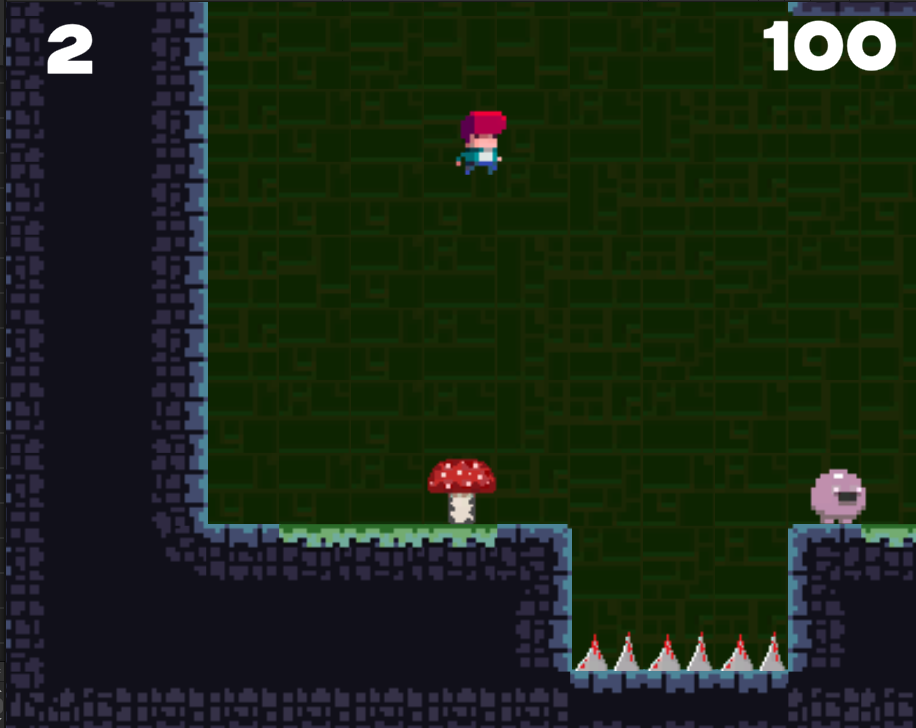
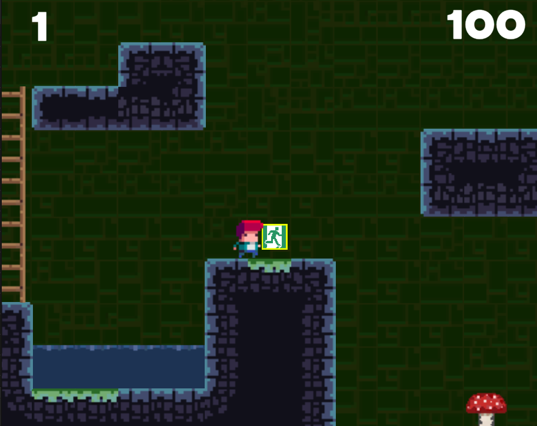

## 연습 중점
"Tile Bania"*에서는 미로 지형을 탈출하는 플레이어의 움직임과 그를 쫓는 AI 구현에 집중하여 연습했습니다. 또한, 다음 미로로 이동하는 과정을 구현하며 다양한 게임 메커니즘을 익혔습니다.

## 사용 도구
- **개발 툴**: Unity, C#
- **그래픽 툴**: Photoshop, Unity Asset

## 주요 기능 및 특징
- **화면 전환**: Unity의 씬매니저(SceneManager)를 활용하여 씬(Scene) 간 이동 및 전환하는 방법을 학습했습니다.
- **AI 구현**: Unity의 콜라이더(Collider)를 활용하여 플레이어와의 접촉을 감지하고, AI가 플레이어를 추격하는 움직임을 구현했습니다.

## 연습 기간
- **2024.08.20 ~ 2024.09.20**

## 배운 점 및 성과
- 씬매니저(SceneManager)의 SceneLoad 함수를 통해 씬(Scene)을 전환하는 방법을 습득했습니다.
- 플레이어를 추격하는 적의 움직임을 간단한 로직으로 구현하였으며, 낭떠러지 등의 지형을 감지해 특정 조건에서 추격하지 않도록 설계했습니다.

## 얻은 아이디어
- 씬매니저(SceneManager)를 이용하여 마을과 던전 사이를 이동하는 시스템을 구현할 수 있는 아이디어를 얻었습니다.
- 간단한 적의 움직임은 복잡한 AI 함수가 아닌 간단한 로직을 통해서도 충분히 구현할 수 있음을 배웠습니다.

[참고사이트](https://www.udemy.com/ko/)

---
