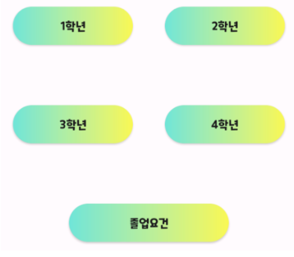
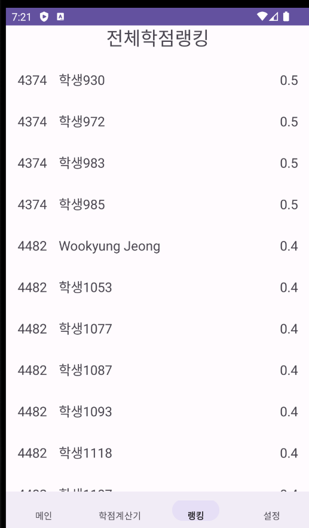

  <!-- 이미지 영역을 flex로 동일한 비율로 균등 배치하고, 크기를 적절히 조정합니다. -->
  

    
  

  

    
  

  

    
  

  

    
  

## 프로젝트 소개
"Bill Gates"는 전북대학교 컴퓨터 인공지능 학부 학생들을 위해 개발된 애플리케이션입니다. 이 앱은 학점과 시간표 관리를 효율적으로 지원하며, 개인에게 최적화된 수강 로드맵을 쉽게 구성할 수 있도록 도와줍니다.

## 담당 파트 
- **4인 개발**: 로그인 화면, 메인 화면, 로드맵 화면, 학점 계산기, 랭킹을 담당했습니다.

## 애플리케이션 사양
- **플랫폼**: Android
- **개발 도구**: Android Studio, Kotlin

## 주요 기능 및 특징
- **로드맵 관리**: 여러 단계로 구성된 수강 로드맵을 시각화하고, 각 단계 간의 상관관계를 명확하게 구성하였습니다.
- **편의성**: 직관적인 UI와 스크롤 및 터치 통해 쉽게 학점 및 시간표를 관리할 수 있도록 설계하였습니다.

## 앱 디자인 및 UI
- 깔끔하고 친숙한 폰트를 사용하여 누구나 쉽게 접근할 수 있는 UI를 제공하였습니다.
- 각 버튼에 그라데이션 효과를 적용해 다채로운 색상을 강조하였습니다.

## 개발 과정
- **1주차**: JIRA를 이용해 주차별로 일정 계획했습니다.
- **2주차**: 메뉴바, 메인화면, 학점계산기 등의 기본 화면을 구성했습니다.
- **3주차**: 데이터베이스 구현, 학점계산기 수정, 하단메뉴바 수정 등 UI 측면을 개선했습니다.
- **4주차**: 회원가입 기능과 로그아웃 기능 구현했습니다.
- **4주차**: 데이터베이스와 연동된 랭킹 기능 구현을 완료, 디자인 개선과 테스트를 진행, 학년별 교과정보 추가, 수강한 과목 체크박스 등 기능개선이 이뤄졌습니다.

## 개발 기간
- **2023.11.17 ~ 2023.12.20**

## 배운 점 및 성과
- 프로젝트와 데이터 관리 방법에 대한 지식을 습득할 수 있었습니다.
- 버그 수정 및 테스트 플레이 과정을 통해 테스트의 중요성을 깨달았습니다.

## 향후 계획
- 다른 학과의 수강 로드맵을 추가로 구현하여 사용 범위를 확대하고자 합니다.
- 사용자 커스터마이징 요소를 추가하여 자유성을 제공하고 싶습니다.

---
