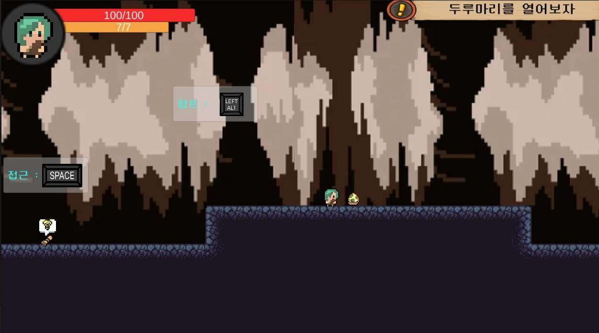

## 프로젝트 소개
"Dino Adventure"는 아기 공룡들과 함께 동굴을 탐험하는 2D 플랫포머 게임입니다. 다양한 퍼즐과 장애물을 극복하며 모험하는 재미를 강조한 작품입니다.

## 담당 파트
- **1인 개발**: 기획, 디자인, 프로그래밍, 레벨 디자인 등 게임의 전반적인 부분을 모두 담당했습니다.

## 게임 사양
- **플랫폼**: PC
- **개발 툴**: Unity, C#
- **그래픽 툴**: Photoshop, Aseprite

## 주요 기능 및 특징
- **독특한 동굴 맵 디자인**: 다양한 레벨로 구성된 동굴 환경을 탐험하며, 각 레벨마다 다른 퍼즐과 함정을 갖추고 있습니다.
- **간단한 컨트롤**: 키보드로 간단한 움직임과 점프를 통해 게임을 플레이할 수 있도록 설계하였습니다.

## 게임 디자인 및 그래픽
- 공룡 캐릭터를 귀여운 스타일로 디자인 
- 동굴의 어두운 배경과 사운드를 통해 음산한 분위기 연출

## 개발 과정
- **기획 단계**: 기본 게임 컨셉과 스토리를 확정하고, Aseprite로 캐릭터 디자인 초안을 그렸습니다.
- **프로그래밍 단계**: Unity를 사용하여 게임의 기본 시스템(플레이어 이동, 점프, 충돌 감지)을 구현하였고, 이후 레벨 별로 퍼즐과 장애물을 추가했습니다.
- **테스트 및 디버깅**: 테스트 플레이를 통해 발견된 버그를 수정하고, 게임의 난이도와 밸런스를 조정했습니다.

## 제작 기간
- **2024.05.20 ~ 2024.07.08**

## 배운 점 및 성과
- Unity를 활용한 게임 개발 전체 과정을 직접 경험하면서 프로그래밍 실력과 게임 디자인 감각을 향상시킬 수 있었습니다.
- 완성된 게임을 통해 게임 개발 과정의 기획부터 체험해봤고 자료의 관리 방법에 대해 알게 되었습니다.

## 향후 계획
- 추가적인 게임 모드와 다양한 스테이지를 추가하여 플레이어에게 더 풍부한 경험을 제공할 계획입니다.
- 다양한 공룡 캐릭터 디자인 추가 및 여러 스킬을 추가해보고 싶습니다.

---
