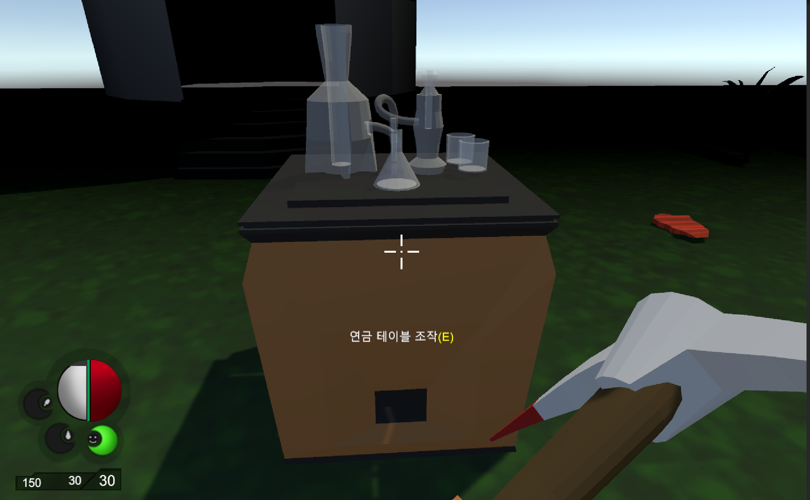

## 연습 중점
"3D Survival"는 플레이어를 쫓는 AI구현 및 플레이어의 생존에 필요한 아이템을 얻고 도구를 만드는 과정을 연습했습니다.

## 사용 도구
- **개발 툴**: Unity, C#
- **그래픽 툴**: Photoshop, Unity Asset

## 주요 기능 및 특징
- **도구배치**: Unity의 레이어(Layer)와 레이캐스트(RayCast)를 이용하여 도구를 배치하였습니다.
- **움직임 애니메이션**: 유니티의 애니메이터(Animator)과 애니메이션(Animation)을 통해 플레이어의 움직임을 구현했습니다.

## 연습 기간
- **2024.08.20 ~ 2024.09.20**

## 배운 점 및 성과
- Unity의 레이어(Layer)와 레이캐스트(RayCast)를 이용하여 레이캐스트(RayCast)를 통해 레이어(Layer)를 판별하고 설정한 레이어구역에 아이템을 배치하는 방법을 알게 되었습니다.
- 유니티의 애니메이터(Animator)과 애니메이션(Animation)의 차이를 알게되었고, 자동, 수동으로 만드는 애니메이션(Animation)을 알게되었습니다. 

## 얻은 아이디어
- RPG 게임에서 마을의 NPC와 상호작용하는 시스템이 이러한 방식으로 구현된다는 점을 이해하게 되었습니다.
- NPC와 아이템을 사고파는 과정을 통해 아이템 수가 늘어나는 방식과 아이템 관리에 대한 이해를 넓혔습니다.

---
