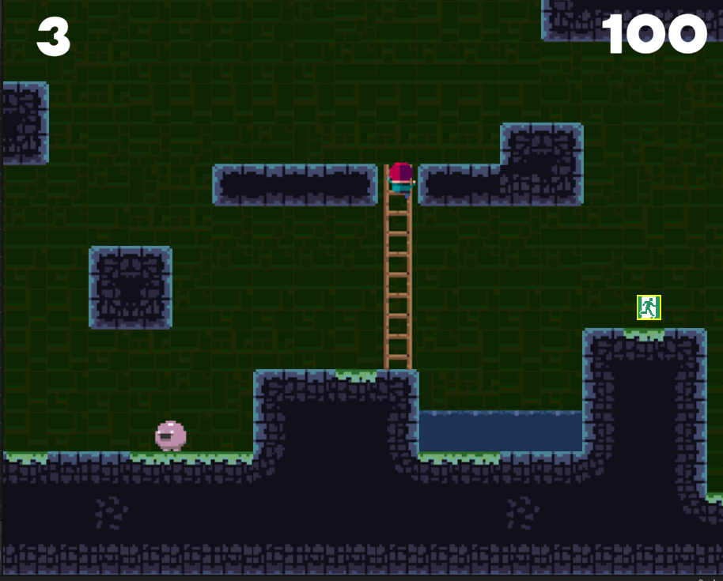

## 연습 중점
"Tile Bania"에서는 플레이어를가 미로 지형을 탈출하며 그 과정에서 플레이어를 쫓는 AI 구현과 함께 다음 미로로 이동하는 방법에 대해 연습하였습니다.

## 사용 도구
- **개발 툴**: Unity, C#
- **그래픽 툴**: Photoshop, Unity Asset

## 주요 기능 및 특징
- **화면 전환**: Unity의 레이어(Layer)와 레이캐스트(RayCast)를 활용하여 도구를 배치하고 환경과의 상호작용을 구현했습니다.
- **AI 구현**: Unity의 오브젝트가 콜라이더(Collider)를

## 연습 기간
- **2024.08.20 ~ 2024.09.20**

## 배운 점 및 성과
- Unity의 레이캐스트(RayCast)를 사용해 레이어(Layer)를 판별하고, 이를 활용하여 특정 레이어 구역에 아이템을 배치하는 방법을 배웠습니다.
- Unity에서 애니메이터(Animator)와 애니메이션(Animation)의 역할과 차이점을 이해하였으며, 자동 및 수동 애니메이션 제작 방법을 습득했습니다.

## 얻은 아이디어
- 생존 게임에서 자원을 수집해 건축물을 짓는 과정을 구현하는 방법을 배울 수 있었습니다.
- 정교한 움직임을 가진 애니메이션은 많은 프레임을 통해 부드럽게 표현된다는 점을 이해하게 되었습니다.

---
